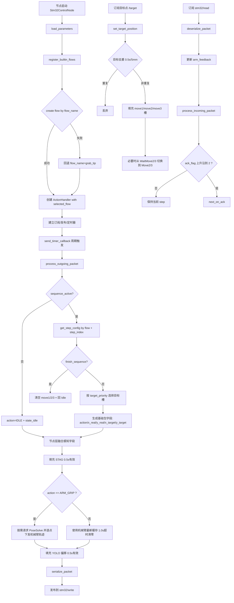

# stm32_control 流程图

```mermaid
flowchart TD
    A[节点启动 Stm32ControlNode] --> B[load_parameters]
    B --> C[register_builtin_flows]
    C --> D{"create flow by flow_name"}
    D -- 成功 --> E[创建 ActionHandler with selected_flow]
    D -- 失败 --> D1[回退 flow_name=grab_tip]
    D1 --> E
    E --> F[建立订阅/发布/定时器]

    F --> G[send_timer_callback 周期触发]
    G --> H[process_outgoing_packet]

    H --> H1{"sequence_active?"}
    H1 -- 否 --> H2[action=IDLE + state_idle]
    H1 -- 是 --> H3[get_step_config by flow + step_index]

    H3 --> H4{"finish_sequence?"}
    H4 -- 是 --> H5[清空 move1/2/3 + 回 Idle]
    H4 -- 否 --> H6[按 target_priority 选择目标槽]
    H6 --> H7[生成基础包字段: action/x_real/y_real/x_target/y_target]

    H2 --> I[节点层融合感知字段]
    H7 --> I

    I --> I1[填充 STAG 0.5s有效]
    I1 --> I2{"action == ARM_GRIP ?"}
    I2 -- 是 --> I3[按需请求 PoseSolve 并逐点下发机械臂轨迹]
    I2 -- 否 --> I4[使用机械臂最新缓存 1.0s超时清零]
    I3 --> I5[填充 YOLO 偏移 0.5s有效]
    I4 --> I5

    I5 --> J[serialize_packet]
    J --> K[发布到 stm32/write]

    L[订阅 stm32/read] --> M[deserialize_packet]
    M --> N[更新 arm_feedback]
    N --> O[process_incoming_packet]

    O --> O1{"ack_flag 上升沿到 2 ?"}
    O1 -- 否 --> O2[保持当前 step]
    O1 -- 是 --> O3[next_on_ack]

    P[订阅目标点 /target] --> Q[set_target_position]
    Q --> R{目标去重 0.5s/5mm}
    R -- 重复 --> R1[丢弃]
    R -- 非重复 --> S[填充 move1/move2/move3 槽]
    S --> T[必要时从 WaitMove2/3 切换到 Move2/3]
```